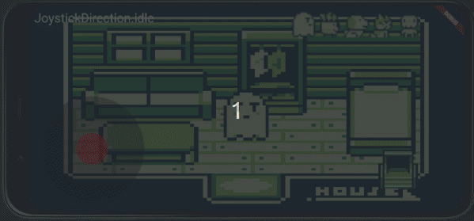

# flame animation demo

Flutter flame animation demo

[web demo](https://codetricity.github.io/flame_animation_tutorial_boboo/)

## learning objectives

### graphics

* `Sprite`
* `SpriteAnimation` from sprite sheet
* `SpriteAnimationGroupComponent`

### movement

* collision
* `JoystickComponent`

### screen

* resize
* web, android, linux desktop
* GitHub actions to deploy to web
  * workflow permissions must be set to read and write
